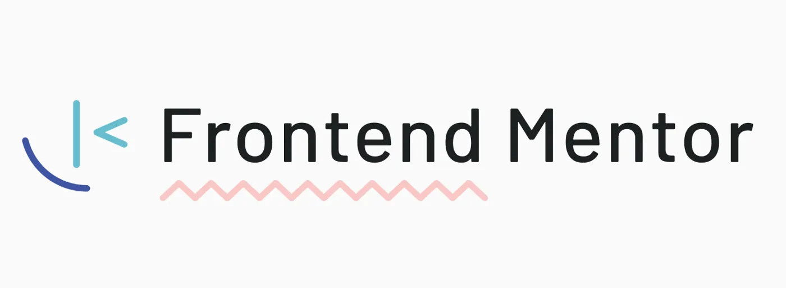

<figure>
  
</figure>

# frontendmentor-solutions

Solutions for the Frontend Challenges on Frontend Mentor

## Challenges

| Number | Challenges                                                                                                                   |                Solutions                |
| :----: | ---------------------------------------------------------------------------------------------------------------------------- | :-------------------------------------: |
|   1    | [Single Price Grid Component](https://www.frontendmentor.io/challenges/single-price-grid-component-5ce41129d0ff452fec5abbbc) | [Solution](single-price-grid-component) |
|   2    | [Testimonials Grid Section](https://www.frontendmentor.io/challenges/testimonials-grid-section-Nnw6J7Un7)                    |  [Solution](testimonials-grid-section)  |

## Acknowledgments

I would like to give speacial thanks to @zachgoll (Zach Gollwitzer), for his incredible free crashcourse video "Frontend Web Development Bootcamp Course (JavaScript, HTML, CSS)" on freeCodeCamp.org channel on YouTube, who led me to this challenge. A fantastic teacher in every way!

Here are some links if you want to see his work:

- Website - [zachgollwitzer.com](https://zachgollwitzer.com)
- Twitter - [@zg_dev](https://twitter.com/zg_dev)
- YouTube - [@zachgoll](https://www.youtube.com/@zachgoll/about)
- The above mentioned video - [Frontend Bootcamp](https://www.youtube.com/watch?v=zJSY8tbf_ys&t=58873s)

  
